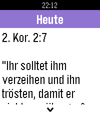

# JW Daily Text for Pebble

*Read today's Bible text and commentary on your Pebble smartwatch.*

JW Daily Text brings the daily scripture and commentary from jw.org to your
wrist. Open the app in the morning and the text is already there — the app
prefetches the coming days in the background, so it keeps working even when
your watch is away from your phone.

| Today | Next day preview | Translated UI |
|---|---|---|
|  |  |  |

## Features

- **Today's text at a glance** — the header shows "Today" when you are on the
  current day, and the weekday and date otherwise ("Fri July 17th").
- **Offline-first** — texts are cached on the watch and on the phone; the app
  syncs upcoming days in the background so it works without a connection.
- **Your language, automatically** — the app preselects the watch's system
  language on first run and translates its whole UI (English, German, Italian,
  Spanish, French, and more for the content itself — every language available
  on wol.jw.org).
- **Made for your wrist** — full-color design on color models, smooth swap
  animations when moving between days, and 1:1 touch scrolling on touchscreen
  models (drag to scroll, pull past the edge to switch days).
- **Loading that respects your time** — an animated loading bar with a reveal
  animation instead of a bare "Loading..." text.

## Usage

- **Up / Down buttons** — scroll the text; keep scrolling past the end to move
  to the next or previous day with a smooth animation.
- **Touchscreen** — drag to scroll 1:1; pull deliberately past the top or
  bottom edge to switch days.
- **Select** — retry loading if no data is available.
- **Language and options** — open the app settings in the Pebble phone app to
  pick any language available on wol.jw.org and adjust how many days are kept
  cached.

## Install

Install **JW Daily Text** from the
[Pebble app store](https://apps.repebble.com/672b1221aeef4d30897a361c) on your
phone, or sideload the `.pbw` from the latest
[GitHub release](https://github.com/testarossa47/jw-daily-text/releases) with:

```sh
pebble install --phone <phone-ip> build/jw-daily-text.pbw
```

## Build from source

Requires the [Pebble SDK](https://developer.rebble.io/) (target platform:
`emery`).

```sh
pebble build
pebble install --emulator emery build/jw-daily-text.pbw   # emulator
pebble install --phone <phone-ip> build/jw-daily-text.pbw # physical watch
```

Project layout:

- `src/c/mdbl.c` — the watch app (UI, caching, day navigation, touch input)
- `src/pkjs/index.js` — the phone companion (fetches texts from wol.jw.org,
  caches them in `localStorage`, background yearly import)
- `config/` — the settings page and the language catalogue
- `store/` — app store listing assets (icons, screenshots)

## Data source

All texts are retrieved at runtime from
[wol.jw.org](https://wol.jw.org) (Watchtower ONLINE LIBRARY) in the language
configured in the app settings. The app stores fetched texts only locally on
your devices.
